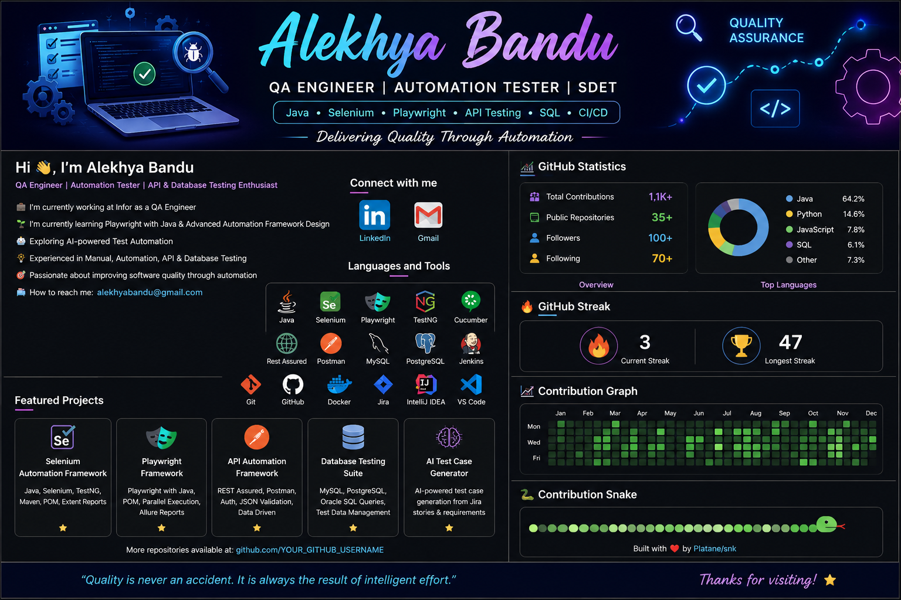

<!-- ===================================== -->
<!--              QA BANNER                -->
<!-- ===================================== -->

  

<h1 align="center">Hi 👋, I'm Alekhya Bandu</h1>

<h3 align="center">
QA Engineer | Automation Tester | API Testing | Database Testing | AI Testing Enthusiast
</h3>

---

# 👩‍💻 About Me

- 💼 QA Engineer with **5+ years** of experience
- 🏢 Currently working at **Infor**
- 🌱 Currently learning **Playwright with Java**
- 🤖 Exploring **AI-powered Software Testing**
- 🧪 Experienced in **Manual, Automation, API & Database Testing**
- 🚀 Passionate about building reliable automation frameworks
- 📫 Reach me at **bandualekhya11@gmail.com**

---

# 💬 Ask Me About

---

# 🌐 Connect With Me

---

# 🛠 Languages & Tools

---

# 🚀 Featured Projects

| 🚀 Project | Description |
|------------|-------------|
| 🧪 Selenium Automation Framework | Java + Selenium + TestNG + Maven + POM |
| 🎭 Playwright Automation Framework | Playwright + Java + Parallel Execution |
| 🌐 REST API Automation | REST Assured + Postman |
| 🗄 Database Testing | Oracle + PostgreSQL + MySQL |
| 🤖 AI Test Case Generator | AI-powered Test Case Generation |

---

# 🔥 GitHub Streak

---

# 📈 Contribution Graph

---

# 🐍 Contribution Snake

---

# 📚 Currently Learning

- 🎭 Playwright with Java
- ☁ CI/CD
- 🤖 AI Testing
- ⚡ Automation Framework Design

---

# 💡 Quote

> **"Quality is never an accident. It is always the result of intelligent effort."**

---

<h3 align="center">
⭐ Thanks for visiting my profile! ⭐
</h3>
